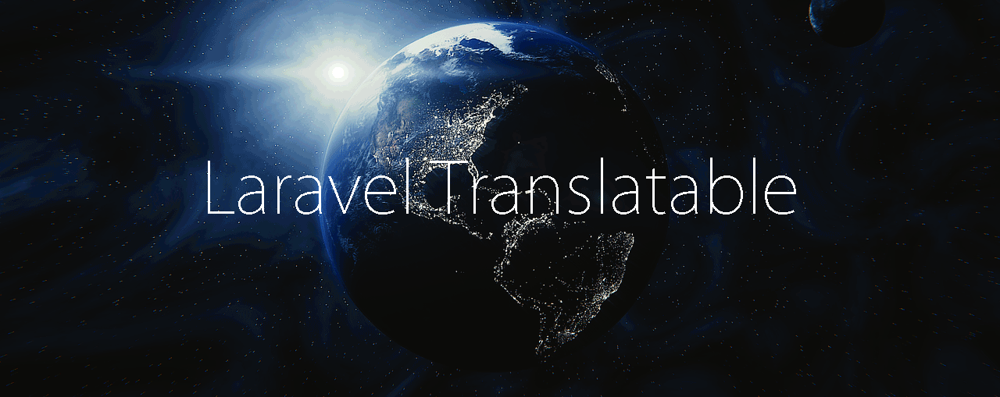

# Introduction

[](https://packagist.org/packages/astrotomic/laravel-translatable) [](https://circleci.com/gh/Astrotomic/laravel-translatable) [](https://styleci.io/repos/192333549) [](https://scrutinizer-ci.com/g/Astrotomic/laravel-translatable/) [](https://codeclimate.com/github/Astrotomic/laravel-translatable) [](https://scrutinizer-ci.com/g/Astrotomic/laravel-translatable/) [](https://packagist.org/packages/astrotomic/laravel-translatable)  [](https://opencollective.com/astrotomic)



**If you want to store translations of your models into the database, this package is for you.**

This is a Laravel package for translatable models. Its goal is to remove the complexity in retrieving and storing multilingual model instances. With this package you write less code, as the translations are being fetched/saved when you fetch/save your instance.

## Quick Example

### Getting translated attributes

```php
$post = Post::first();
echo $post->translate('en')->title; // My first post

App::setLocale('en');
echo $post->title; // My first post

App::setLocale('de');
echo $post->title; // Mein erster Post
```

### Saving translated attributes

```php
$post = Post::first();
echo $post->translate('en')->title; // My first post

$post->translate('en')->title = 'My cool post';
$post->save();

$post = Post::first();
echo $post->translate('en')->title; // My cool post
```

### Filling multiple translations

```php
$data = [
  'author' => 'Gummibeer',
  'en' => ['title' => 'My first post'],
  'fr' => ['title' => 'Mon premier post'],
];
$post = Post::create($data);

echo $post->translate('fr')->title; // Mon premier post
```

## Tutorials

* [How To Add Multilingual Support to Eloquent](https://laravel-news.com/how-to-add-multilingual-support-to-eloquent)
* [How To Build An Efficient and SEO Friendly Multilingual Architecture For Your Laravel Application](https://mydnic.be/post/how-to-build-an-efficient-and-seo-friendly-multilingual-architecture-for-your-laravel-application)
* [How to Add Multi-Language Models to Laravel QuickAdminPanel](https://quickadminpanel.com/blog/how-to-add-multi-language-models-to-laravel-quickadminpanel/)

## Versions

| Package | Laravel | PHP |
| :--- | :--- | :--- |
| **v11.4 - v11.5** | `5.6.* / 5.7.* / 5.8.* / 6.*` | `>=7.1.3` |
| **v11.0 - v11.3** | `5.6.* / 5.7.* / 5.8.*` | `>=7.1.3` |

